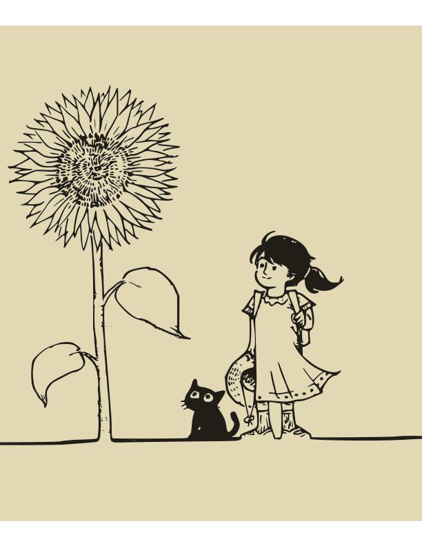
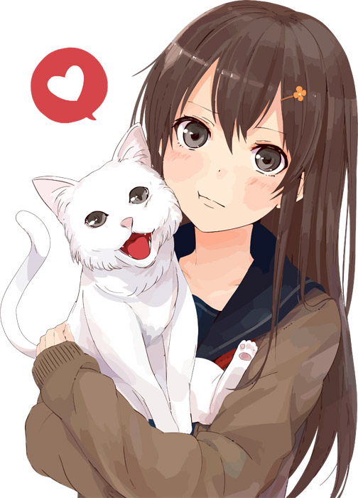
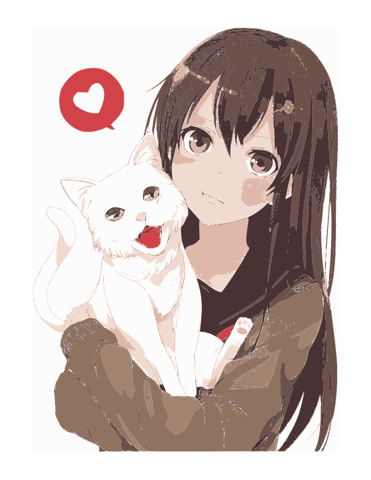
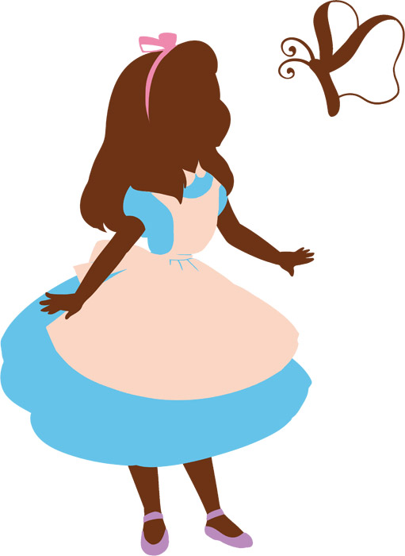
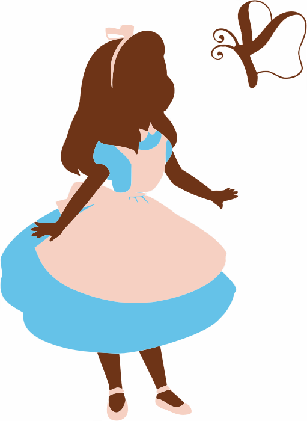
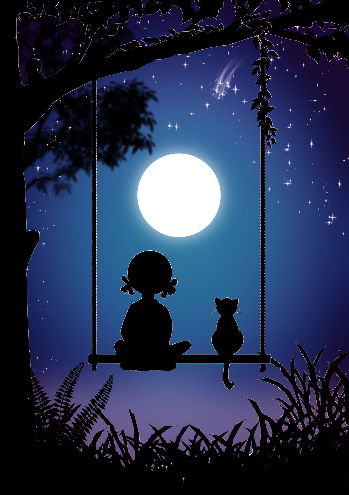
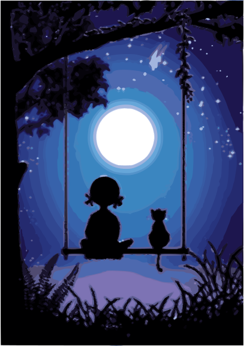
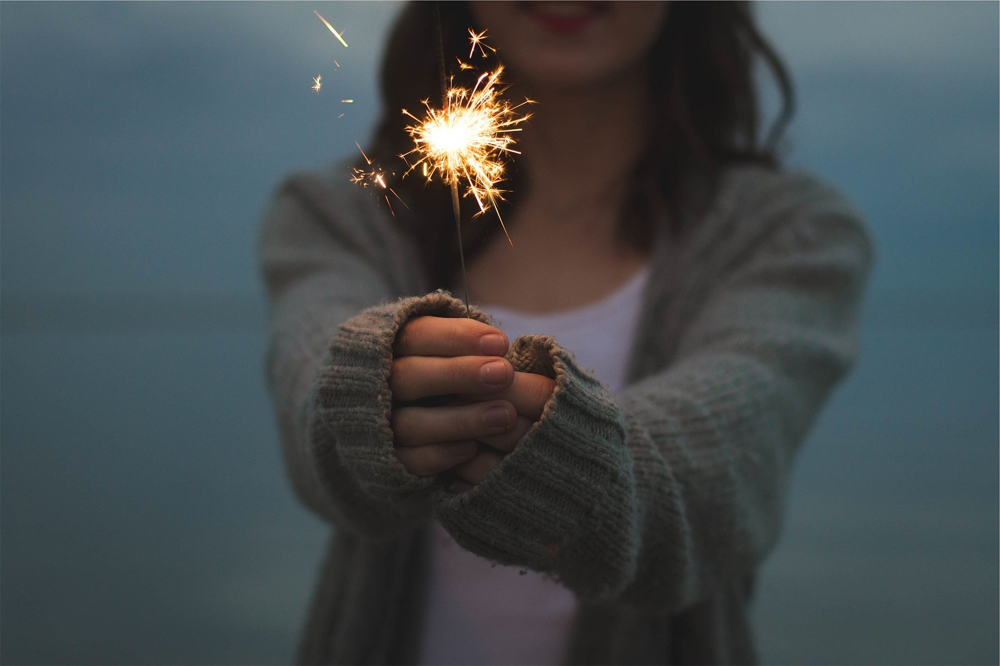

# img2ras

Transforming bitmaps into vector graphics.

## How to build

```
$ make
```

## How to use

```
$ ./img2ras
Usage: ./img2ras [options] file

Options:
-h                 Print this message
-o <output name>   Output file name [default: img2ras.eps]
-svg               Output file type [default: eps]
-c <num>           Reduce color [default: 32]
-b <scale>         Blur image

$ ./img2ras girl-1118419_1280.jpg -c 2 -o girl-1118419.eps
$ ./img2ras publicdomainq-0041064ikt.jpg -c 8 -a -b 12 -o publicdomainq-0041064ikt.eps
$ ./img2ras publicdomainq-0017653mro.jpg -c 5 -a -o publicdomainq-0017653mro.eps
$ ./img2ras hairdress-4912246.jpg -o hairdress-4912246.svg -svg -a

$ ./img2ras 1098751.jpg -o 1098751.eps -c 48 -a -cx -b 14
$ ./img2ras night-4926430_1920.jpg -c 16 -o night-4926430.eps
$ ./img2ras sparkler-677774_1920.jpg -c 32 -x -o sparkler-677774.eps
```

## Example

Original image (https://pixabay.com/ja/illustrations/%E5%A5%B3%E3%81%AE%E5%AD%90-%E7%8C%AB-%E8%8A%B1-%E3%81%8A%E3%81%A8%E3%81%8E%E8%A9%B1-1118419/
)


img2ras output


Original image


img2ras output


Original image


img2ras output


Original image


img2ras output


Original image


img2ras output


